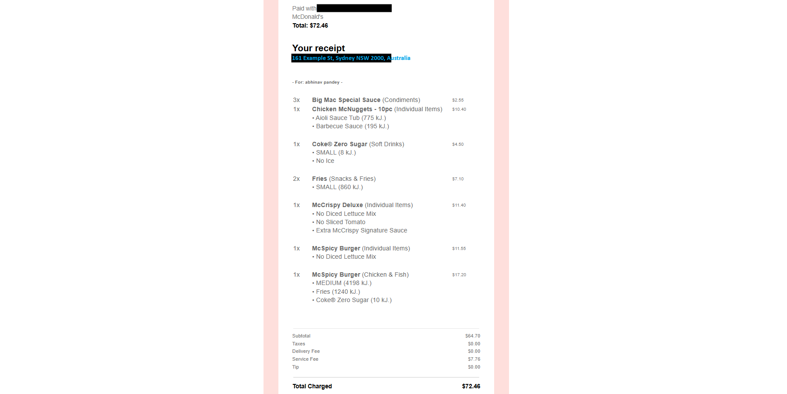

# Eats Data Miner

_A Gmail-to-Google Sheets automation for food delivery expense tracking._

## Overview

Like many people, I found myself spending way more on DoorDash orders than I realized. Tracking those expenses manually was tedious and limited.

So I created **Eats Data Miner** — an end-to-end data pipeline project that automates DoorDash expense tracking.

It uses **Python**, **Gmail API**, **Google Sheets API**, and **Looker Studio** to fetch, organize, and visualize DoorDash spending data.

At a high level, Eats Data Miner:

- Fetches DoorDash _order confirmation_ emails ([see example below](#sample-input-doordash-order-confirmation-email)) from your Gmail Inbox,
- Extracts order details from email contents (eg. _restaurant_, _items_, _costs_, _date_, etc),
- Structures the data into clean, _connected_ Google Sheets tables,
- Automatically updates a _customizable_ dashboard for spending insights.

### 📊 Dashboard Preview

<p align="left">
  <em>Tracking food delivery habits with Python and Looker Studio.</em>
</p>

<p align="center">
  
</p>

---

## 📚 Table of Contents

**Quick Navigation**

- [How it works](#heres-how-it-works)
- [Setup Instructions](#setup-instructions)
- [Running the Script](#running-the-script)
- [Sample Input: DoorDash Order Confirmation Email](#sample-input-doordash-order-confirmation-email)
- [Sample Output](#sample-output)

---

## Here’s how it works:

Eats Data Miner follows a simple six-step process:

1. **Connect to Gmail** – Authenticate and fetch order confirmation emails.
2. **Extract** – Parse vendor, item, pricing, fees, and delivery details.
3. **Transform** – Flatten and organize extracted data into clean tables.
4. **Validate** – Apply rule checks to catch parsing errors early.
5. **Load** – Save results to local CSV files and a connected Google Sheets workbook (`Orders` and `OrderItems` tables).
6. **Visualize** – Connect to a Looker Studio dashboard for instant insights.

## Setup Instructions

To run this project, you will need to:

- Create a `creds/` directory in the project root,
- Set up Gmail API access,
- Set up Google Sheets API access,
- Add your credentials JSON files into the `creds/` directory,
- Create your destination Google Sheet ("Doordash Orders"),
- Share the Sheet with your service account email,
- Set up a connected Looker Studio dashboard.

You can view the full setup guide [here](./SETUP_INSTRUCTIONS.md), or jump directly to a specific section:

**Quick Navigation**

- [Prerequisites](./SETUP_INSTRUCTIONS.md#1-prerequisites)
- [Clone the Repository & Create Project Folders](./SETUP_INSTRUCTIONS.md#2-clone-the-repository--create-the-project-folders)
- [Set up Gmail API access](./SETUP_INSTRUCTIONS.md#3-set-up-gmail-api-access)
- [Set up Google Sheets API access](./SETUP_INSTRUCTIONS.md#4-set-up-google-sheets-api-access)
- [Create and Share the Destination Google Sheet](./SETUP_INSTRUCTIONS.md#5-create--share-the-destination-google-sheet)
- [Prepare the Looker Studio Dashboard](./SETUP_INSTRUCTIONS.md#6-prepare-the-looker-studio-dashboard)
- [Install Dependencies](./SETUP_INSTRUCTIONS.md#7-install-dependencies)
- [Run the Pipeline](./SETUP_INSTRUCTIONS.md#8-run-the-pipeline)
- [Troubleshooting](./SETUP_INSTRUCTIONS.md#9-troubleshooting)

## Running the Script

Once your credentials are set up, running Eats Data Miner is simple. Below is how to execute the script, followed by examples of the input it processes and the structured output it generates.

```bash
python main.py
```

This will:

- Authenticate your Gmail account,
- Fetch and parse your DoorDash order confirmation emails,
- Validate and clean the extracted data,
- Save results to `orders.csv` and `order_items.csv`,
- Update your connected Google Sheet,
- Refresh your Looker Studio dashboard with the latest data.

## Sample Input: DoorDash Order Confirmation Email

<p align="left">
  <em>Screenshot of a DoorDash order confirmation email processed by the script.</em>
</p>

<p align="center">
  
</p>

---

## Sample Output

After processing the above email, the script generates the following structured datasets:

> The Google Sheets workbook is also updated with these tables, keeping data easily accessible for the connected dashboard.

### Orders Table (orders.csv)

| Message ID       | Date       | Store Name | Delivery Address                           | ETA               | Total Charged | Subtotal | Taxes | Delivery Fee | Service Fee | Tip  |
| ---------------- | ---------- | ---------- | ------------------------------------------ | ----------------- | ------------- | -------- | ----- | ------------ | ----------- | ---- |
| 18d4a327ee09e5b6 | 2024-01-27 | McDonald's | 161 Example St, Sydney NSW 2000, Australia | 6:19 pm – 6:29 pm | 72.46         | 64.70    | 0.00  | 0.00         | 7.76        | 0.00 |

---

### Order Items Table (order_items.csv)

| Order Message ID | Item Name                                   | Qty | Modifiers                                                         | Price |
| ---------------- | ------------------------------------------- | --- | ----------------------------------------------------------------- | ----- |
| 18d4a327ee09e5b6 | Big Mac Special Sauce (Condiments)          | 3   |                                                                   | 2.55  |
| 18d4a327ee09e5b6 | Chicken McNuggets - 10pc (Individual Items) | 1   | Aioli Sauce Tub (775 kJ.) \| Barbecue Sauce (195 kJ.)             | 10.40 |
| 18d4a327ee09e5b6 | Coke Zero Sugar (Soft Drinks)               | 1   | SMALL (8 kJ.) \| No Ice                                           | 4.50  |
| 18d4a327ee09e5b6 | Fries (Snacks & Fries)                      | 2   | SMALL (860 kJ.)                                                   | 7.10  |
| 18d4a327ee09e5b6 | McCrispy Deluxe (Individual Items)          | 1   | No Diced Lettuce Mix \| No Sliced Tomato \| Extra Signature Sauce | 11.40 |
| 18d4a327ee09e5b6 | McSpicy Burger (Individual Items)           | 1   | No Diced Lettuce Mix                                              | 11.55 |
| 18d4a327ee09e5b6 | McSpicy Burger (Chicken & Fish)             | 1   | MEDIUM (4198 kJ.) \| Fries (1240 kJ.) \| Coke Zero Sugar (10 kJ.) | 17.20 |

---
